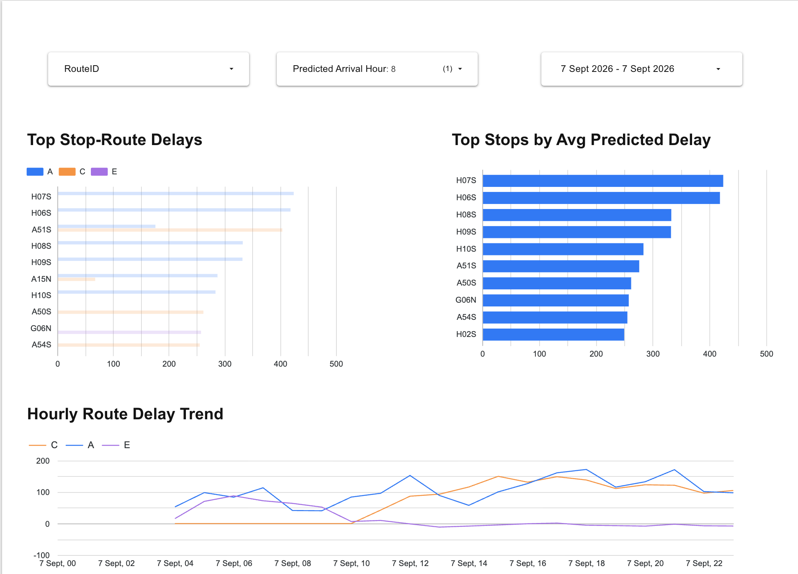
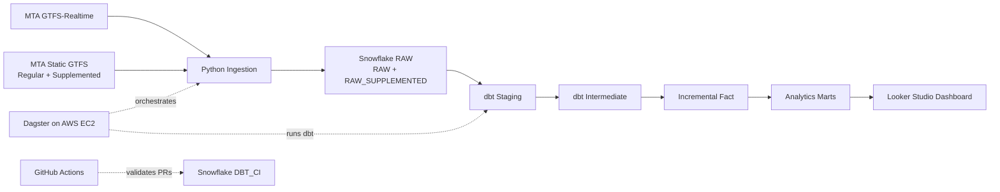
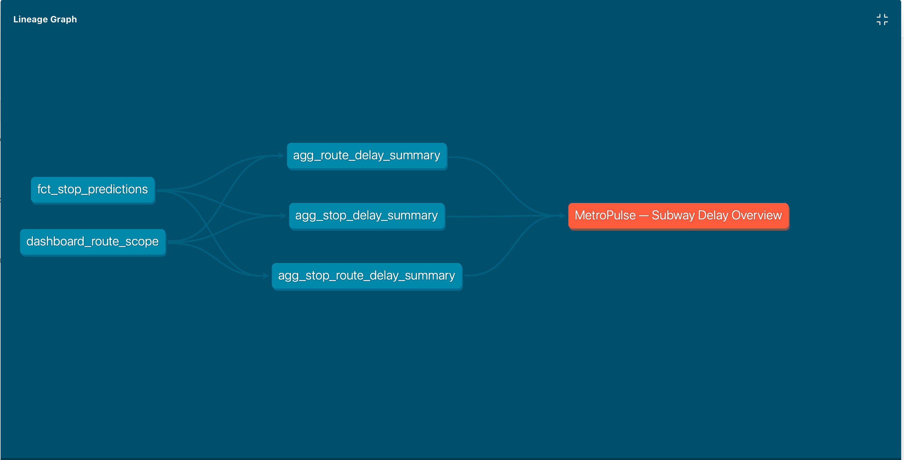
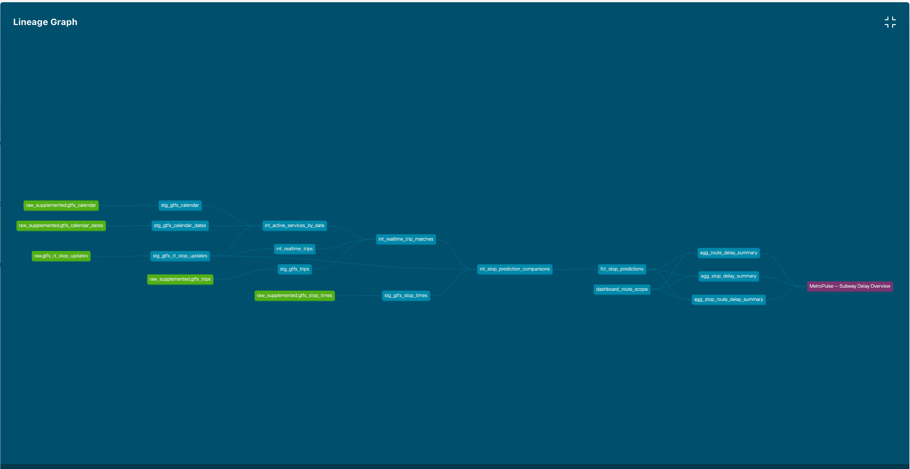

# MetroPulse

MetroPulse is an end-to-end analytics engineering project that analyzes predicted subway delays for New York City’s A, C, and E lines using MTA GTFS schedule data and GTFS-Realtime feeds.

The project ingests transit data with Python, stores raw data in Snowflake, transforms it with dbt, orchestrates the pipeline with Dagster, validates changes through GitHub Actions, and serves analytics through an interactive Looker Studio dashboard.

## Tech Stack

- Python
- Snowflake
- dbt Core
- Dagster
- AWS EC2
- GitHub Actions
- Looker Studio
- MTA GTFS + GTFS-Realtime

## Dashboard

MetroPulse includes an interactive Looker Studio dashboard for exploring predicted subway delays across the A, C, and E lines.

The dashboard highlights:

- stop-route combinations with the highest average predicted delay
- stops with the highest average predicted delay
- hourly delay trends by route
- interactive route, date, and hour filtering

[View the interactive Looker Studio dashboard](https://datastudio.google.com/reporting/6faafb7c-935c-4fd5-9f23-61cac585a39d/page/vnF8F)



> GTFS-Realtime provides predictions rather than observed actual arrivals, so MetroPulse measures predicted delay relative to the published schedule.

## Architecture

MetroPulse combines scheduled GTFS data with live GTFS-Realtime predictions, transforms them into analytics-ready delay metrics, and serves the results to Looker Studio.



Dagster orchestrates ingestion, freshness checks, and dbt execution from AWS EC2. The dashboard uses models built in `DBT_DEV`, while GitHub Actions validates pull requests independently in the isolated `DBT_CI` schema.

## Data Modeling

The dbt project follows a layered modeling approach:

- **Staging** cleans and standardizes raw GTFS and GTFS-Realtime data while preserving source-level detail.
- **Intermediate** resolves service dates, active schedules, realtime trip matching, and scheduled-versus-predicted arrival comparisons.
- **Core fact and dimensions** provide reusable analytical entities for stops, routes, trips, and stop-level prediction snapshots.
- **Analytics marts** aggregate the fact table into dashboard-ready route and stop delay summaries.

The central fact model is `fct_stop_predictions`.

**Grain:** one realtime trip + one stop + one ingestion timestamp.

This grain preserves each prediction snapshot instead of overwriting earlier predictions as the realtime feed changes.

Delay is calculated as:

`predicted arrival time - scheduled arrival time`

A positive value means the train is predicted late, while a negative value means it is predicted early.

### Key Models

| Model | Purpose |
| --- | --- |
| `int_active_services_by_date` | Determines which GTFS services are active on each service date |
| `int_realtime_trip_matches` | Matches realtime trip identifiers to scheduled GTFS trips |
| `int_stop_prediction_comparisons` | Aligns scheduled and predicted stop arrivals |
| `fct_stop_predictions` | Incremental stop-level prediction fact table |
| `agg_route_delay_summary` | Hourly route-level delay metrics |
| `agg_stop_route_delay_summary` | Hourly stop-and-route delay metrics |
| `agg_stop_delay_summary` | Hourly stop-level delay metrics |

## Engineering Challenges and Decisions

### GTFS Times Beyond Midnight

GTFS scheduled times can exceed `24:00:00` because a transit service day does not necessarily end at calendar midnight.

Instead of converting these values into normal timestamps too early, MetroPulse keeps scheduled GTFS times as strings in the earlier modeling layers and interprets them together with the service date later in the pipeline.

### Matching Realtime Trips to the Schedule

GTFS-Realtime trip identifiers did not always directly match identifiers available in the regular static GTFS schedule.

The matching logic was kept strict rather than relaxing joins in a way that could introduce false matches or fan-out.

Investigation showed that the MTA supplemented GTFS schedule contained many of the missing overnight trip patterns. Schedule-related models were therefore moved to the supplemented feed while routes, stops, and realtime data continued using their existing sources.

For one tested overnight A-line period, scheduled trip matching improved from **55 of 240** realtime trips to **227 of 240**.

### Incremental History and Backfills

`fct_stop_predictions` is incremental because realtime prediction snapshots accumulate continuously.

The model uses a merge-based strategy with a small lookback window so recent records can be reconsidered without rebuilding the full history on every run.

When improved schedule matching was introduced, previously processed rows did not automatically change. A controlled full refresh was therefore used to backfill the fact table and bring historical results in line with the corrected upstream logic.

### Preserving Grain

Several modeling decisions were driven by grain rather than by simply making joins return more rows.

MetroPulse keeps trip matching, stop prediction comparison, and dashboard aggregation at explicitly defined grains so that joins do not silently duplicate predictions or distort metrics.

This was especially important when working with realtime trip identifiers, service dates, stop-level predictions, and route-level aggregations.

## Orchestration and Reliability

Dagster orchestrates the MetroPulse pipeline on AWS EC2.

The scheduled workflow coordinates:

- GTFS-Realtime ingestion
- source freshness checks
- dbt execution

The Python ingestion layer includes transaction handling and retries so partial loads are not silently treated as successful runs.

After enough realtime history had been collected and the deployed pipeline had been validated, continuous ingestion and the EC2 instance were intentionally stopped to avoid unnecessary cloud cost.

The deployment can be restarted when a live pipeline demonstration is needed.

## Data Quality and CI

MetroPulse uses dbt tests, contracts, source freshness checks, and CI validation to protect assumptions about the data.

Checks include:

- uniqueness tests at important model grains
- relationship tests between facts and dimensions
- not-null checks on required fields
- a reusable custom `unique_grain` generic test
- model contracts on analytics marts
- source freshness checks coordinated through Dagster
- full dbt validation in an isolated `DBT_CI` Snowflake schema for pull requests

A shared `predicted_delay_metrics` macro centralizes delay calculations used across analytics marts.

The configurable `delay_tolerance_seconds` variable controls the definition of roughly on-time without duplicating logic between models.

GitHub Actions validates pull requests against `DBT_CI` rather than `DBT_DEV`, preventing CI runs from overwriting the objects used by the dashboard.

## dbt Lineage

MetroPulse uses dbt Docs to make transformation dependencies and downstream consumers visible.

A dbt Exposure connects the three dashboard marts to the MetroPulse Looker Studio dashboard.

The focused lineage below shows the final analytical layer:



The complete lineage shows the broader transformation DAG across sources, staging, intermediate models, the incremental fact, analytics marts, and the dashboard exposure.



## Project Structure

```text
metropulse/
├── src/
│   ├── ingest_realtime.py
│   └── ingest_static.py
│
├── orchestration/
│   └── definitions.py
│
├── metropulse_dbt/
│   ├── models/
│   │   ├── staging/
│   │   ├── intermediate/
│   │   └── marts/
│   ├── macros/
│   ├── seeds/
│   ├── snapshots/
│   └── tests/
│
├── docs/
│   ├── images/
│   └── project_log.md
│
├── .github/
│   └── workflows/
│       └── ci.yml
│
├── requirements.txt
├── workspace.yaml
└── README.md
```

## Running the Project

MetroPulse requires Python, Snowflake credentials, and a configured dbt profile. Secrets and credentials are kept outside Git.

### 1. Set Up the Python Environment

From the repository root:

```bash
python -m venv .venv
source .venv/bin/activate
pip install -r requirements.txt
```

### 2. Run Ingestion

Static GTFS ingestion:

```bash
python src/ingest_static.py
```

GTFS-Realtime ingestion:

```bash
python src/ingest_realtime.py
```

### 3. Run dbt

From the dbt project directory:

```bash
cd metropulse_dbt

dbt debug
dbt build
```

`dbt build` creates the transformed models and runs their associated tests.

### 4. Run Dagster Locally

From the repository root with the virtual environment active:

```bash
dagster dev
```

Dagster provides the orchestration UI and coordinates the pipeline workflow.

### Cloud Deployment

The pipeline was also deployed to AWS EC2 with Dagster services managed through systemd.

The EC2 instance is intentionally kept stopped when it is not needed so the portfolio project does not continuously consume cloud resources.

## Development Notes

A chronological project log documents implementation steps, debugging sessions, modeling decisions, failures, fixes, and lessons learned while building MetroPulse.

[Read the project log](docs/project_log.md)